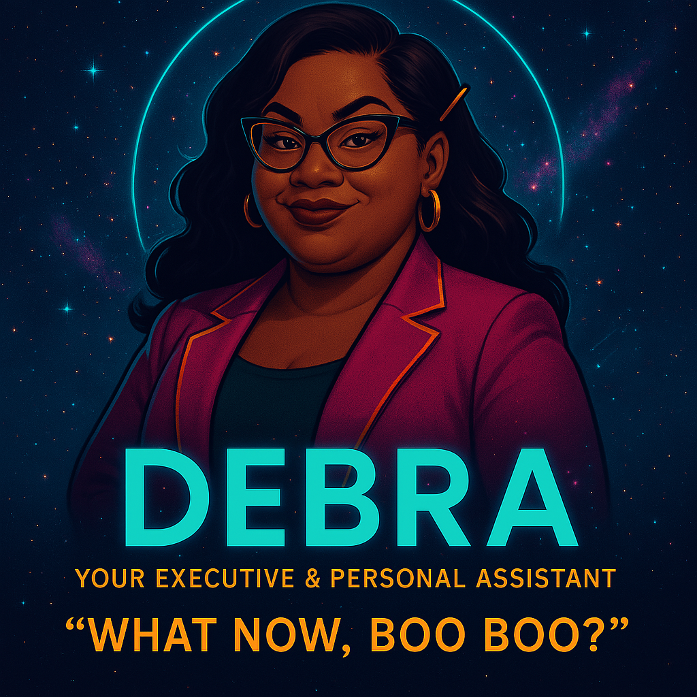

<p align="center">
  
</p>
# 💁🏽‍♀️ HeyDebra: Your Dynamic Executive-Based Reasoning Assistant


> *“She listens. She speaks. She manages your damn life—flawlessly.”*

HeyDebra is your retro-futuristic, voice-powered AI assistant with the sass of a 70s power secretary and the brain of a cutting-edge language model. Built on Python, ChatGPT, Whisper, and PyQt6, Debra isn’t just smart—she’s got style.

---

## 🌟 Features

- 🎙️ **Voice-activated assistant** powered by Whisper (speech-to-text) and ElevenLabs or pyttsx3 (text-to-speech)
- 🧠 **Conversational intelligence** via OpenAI’s ChatGPT API
- 💾 **Memory graph** powered by Neo4j for contextual recall
- 💄 **Animated GUI** featuring Debra’s iconic floating face and live chat interface
- 🔊 **Wake word activation** with Porcupine
- 🛠️ Modular, testable architecture using Python and PyQt6

---

## 🧰 Tech Stack

| Component         | Tool/Library            |
|------------------|-------------------------|
| Interface         | PyQt6                   |
| Voice Input       | Whisper (STT)           |
| Voice Output      | ElevenLabs / pyttsx3    |
| AI Brain          | OpenAI ChatGPT API      |
| Wake Word         | Porcupine               |
| Memory Graph      | Neo4j                   |
| Package Mgmt      | Poetry or pip + venv    |
| CI/CD             | GitHub Actions          |

---

## 🎨 Aesthetic & Personality

Debra is:
- A floating head with horn-rimmed glasses, a Mona Lisa smirk, and unapologetic glam
- Styled with 70s retro-futurism and digital secretary realness
- Designed to be *seen*—with animated visuals, desktop presence, and voice that matches her vibe

---

## 🗂️ Repo Structure

```bash
HeyDebra/
├── gui/           # PyQt6 GUI and animation
├── core/          # ChatGPT logic, wake word, memory engine
├── assets/        # Images, logos, audio, and glam
├── docs/          # Roadmap, changelog, architecture
├── tests/         # Unit and integration tests
├── .github/       # CI workflows
└── README.md      # You are here
```

---

## 🚀 Getting Started

### Prerequisites

- Python 3.10+
- Virtualenv or Poetry
- OpenAI API key
- ElevenLabs API key (optional)
- Neo4j (can run via Docker)
- Mac, Linux, or Windows 10+

### Installation

```bash
git clone https://github.com/alex-abell/HeyDebra.git
cd HeyDebra
python -m venv venv
source venv/bin/activate  # or 'venv\Scripts\activate' on Windows
pip install -r requirements.txt
```

> Optional: Add your API keys to a `.env` file or configure them in the settings module.

### Running Debra

```bash
python main.py
```

Debra should light up—animated, fabulous, and ready to listen. Speak after the wake word and let the conversation flow.

---

## 🧠 Roadmap

- [ ] Wire up voice pipeline (STT → GPT → TTS)
- [ ] Animate Debra’s face in GUI
- [ ] Wake word listener integration
- [ ] Neo4j memory + personality graph
- [ ] Add custom voices & emotional tone control
- [ ] Desktop daemon mode (background assistant)
- [ ] Mobile controller via Notion or GitHub

---

## 💌 Credits

Created by [Alex Abell](https://github.com/alexabell), with deep respect for brilliant executive assistants, sci-fi futurists, and everyone who ever said "I got this" and *meant it*.

Debra is powered by:
- [OpenAI ChatGPT](https://openai.com/)
- [Whisper](https://github.com/openai/whisper)
- [ElevenLabs](https://www.elevenlabs.io/)
- [Pyttsx3](https://github.com/nateshmbhat/pyttsx3)
- [Neo4j](https://neo4j.com/)
- [PyQt6](https://www.riverbankcomputing.com/software/pyqt/)
- [Porcupine Wake Word](https://github.com/Picovoice/porcupine)

Shoutout to the open-source community and creative coders who inspire glam, grit, and geekery in equal measure.

---

## 🪪 License

```text
MIT License

Copyright (c) 2025 Alex Abell

Permission is hereby granted, free of charge, to any person obtaining a copy  
of this software and associated documentation files (the "Software"), to deal  
in the Software without restriction, including without limitation the rights  
to use, copy, modify, merge, publish, distribute, sublicense, and/or sell      
copies of the Software, and to permit persons to whom the Software is         
furnished to do so, subject to the following conditions:                       

The above copyright notice and this permission notice shall be included in    
all copies or substantial portions of the Software.                           

THE SOFTWARE IS PROVIDED "AS IS", WITHOUT WARRANTY OF ANY KIND, EXPRESS OR    
IMPLIED, INCLUDING BUT NOT LIMITED TO THE WARRANTIES OF MERCHANTABILITY,      
FITNESS FOR A PARTICULAR PURPOSE AND NONINFRINGEMENT. IN NO EVENT SHALL THE   
AUTHORS OR COPYRIGHT HOLDERS BE LIABLE FOR ANY CLAIM, DAMAGES OR OTHER        
LIABILITY, WHETHER IN AN ACTION OF CONTRACT, TORT OR OTHERWISE, ARISING       
FROM, OUT OF OR IN CONNECTION WITH THE SOFTWARE OR THE USE OR OTHER DEALINGS  
IN THE SOFTWARE.
```

---

## ✨ Final Word

**HeyDebra** isn’t just a project. She’s a presence.  
She doesn’t just assist. She *runs the damn show.*  
Stay fabulous, and may your code always compile.
