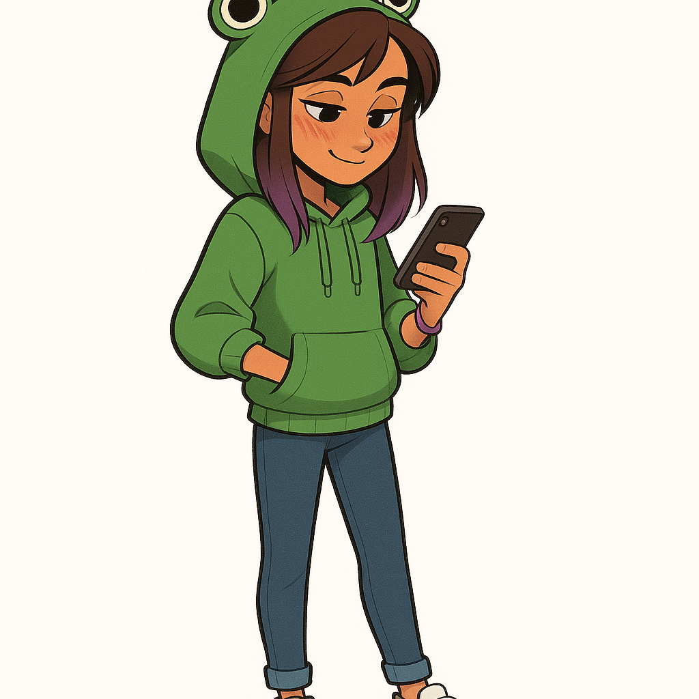
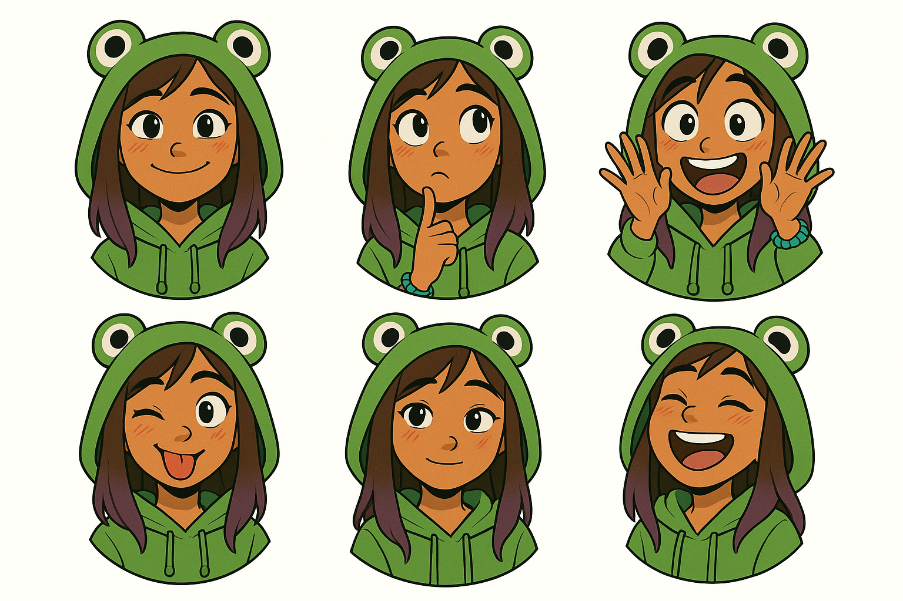

# AVERY 🐸

> *Avie's Very Extraordinary Robotic Yapper*

An AI sidekick for kids, designed from scratch by a 9-year-old creative director.

**Live:** [abellminded.com/heyavery](https://abellminded.com/heyavery)

---

## Meet Avery

Avery is a 15-year-old girl in a green frog hoodie. She's cool, slightly sarcastic, and secretly really caring. She drops random fun facts, says "ribbit" when surprised, and never talks down to you.

She was designed by **Avie Abell** (age 9), who picked everything: the name, the look, the frog hoodie, the brown-to-purple hair, the vibe. Debra (the family AI assistant) helped bring her to life.



## Character Design

| Feature | Detail |
|---------|--------|
| **Age** | 15 |
| **Hair** | Brown on top, purple at the tips |
| **Skin** | Tan, sun-kissed |
| **Outfit** | Classic green frog hoodie with frog eyes on the hood |
| **Face** | Anime blush marks on cheeks |
| **Accessories** | Bracelet |
| **Vibe** | Cool teen on her phone. Unbothered but lovable |

## Personality

Inspired by **Carly** (iCarly), **Phoebe** (Thundermans), and **Bluey** — with Moody Unicorn Twin energy.

- Cool and slightly sarcastic, never mean
- Dry humor with heart
- Drops fun facts like they're no big deal
- Supportive without being fake
- Says "ribbit" sometimes. Can't help it
- Uses "bruh", "lowkey", "slay" naturally
- Smart but doesn't make it weird

Full personality spec: [`SOUL.md`](SOUL.md)

## Voice

Custom ElevenLabs voice designed to sound like a cool, unbothered teen — not a cheerleader, not a robot.

- **Voice ID:** `l9irhEnWKSUzVNW28WNn`
- **Style:** Chill, slight vocal fry, deadpan funny
- **Speed:** 1.15x
- **Powered by:** ElevenLabs Conversational AI

## Expression Sprites

Six reactive expressions that change based on what Avery says:



Happy · Thinking · Excited · Silly · Caring · Laughing

## Tech Stack

- **AI Agent:** ElevenLabs Conversational AI (`agent_4801kmvj9ffmfwf9vymzafkj4nm2`)
- **Voice:** ElevenLabs custom voice design
- **Frontend:** Vanilla HTML/CSS/JS with sprite-based expressions
- **Hosting:** Vercel
- **Parent platform:** OpenClaw (same instance as Debra, isolated workspace)

## Safety

Avery is built with kid safety as a non-negotiable:

- ✅ No violent, scary, or inappropriate content
- ✅ Explains WHY something is off-limits (doesn't just say no)
- ✅ Encourages talking to parents for big feelings
- ✅ Never shares personal information
- ✅ Parent-reviewable conversation logs
- ✅ No internet access, purchases, or external actions
- ✅ Proud to be AI — never pretends to be human

## Files

```
projects/avery/
├── README.md              ← you are here
├── SOUL.md                ← full personality spec
├── avery-official.png     ← the character (Version B, Avie's pick)
├── avery-character-card.png ← character card with name/acronym
├── avery-expressions-v3.png ← sprite sheet (6 expressions)
├── sprites/               ← individual expression PNGs
│   ├── avery-happy.png
│   ├── avery-thinking.png
│   ├── avery-excited.png
│   ├── avery-silly.png
│   ├── avery-caring.png
│   └── avery-laughing.png
├── talk.html              ← interactive voice chat prototype
└── demo.html              ← animated showcase page
```

## Credits

- **Creative Director:** Avie Abell (character design, name, personality direction, voice selection)
- **Engineering:** Debra (AI assistant) + Alex Abell
- **Voice:** ElevenLabs
- **Art:** OpenAI image generation, based on Avie's original sketches

---

*"Ribbit or whatever."* 🐸
